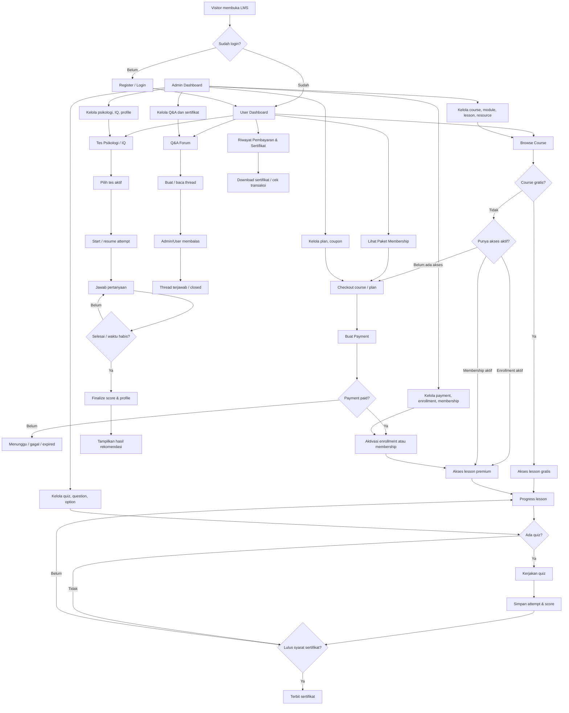

# Business Flow End-to-End

```mermaid
flowchart TD
    A["Visitor membuka LMS"] --> B{"Sudah login?"}
    B -- "Belum" --> C["Register / Login"]
    B -- "Sudah" --> D["User Dashboard"]
    C --> D

    D --> E["Browse Course"]
    D --> F["Lihat Paket Membership"]
    D --> G["Tes Psikologi / IQ"]
    D --> H["Q&A Forum"]
    D --> I["Riwayat Pembayaran & Sertifikat"]

    E --> J{"Course gratis?"}
    J -- "Ya" --> K["Akses lesson gratis"]
    J -- "Tidak" --> L{"Punya akses aktif?"}
    L -- "Enrollment aktif" --> M["Akses lesson premium"]
    L -- "Membership aktif" --> M
    L -- "Belum ada akses" --> N["Checkout course / plan"]

    F --> N
    N --> O["Buat Payment"]
    O --> P{"Payment paid?"}
    P -- "Belum" --> Q["Menunggu / gagal / expired"]
    P -- "Ya" --> R["Aktivasi enrollment atau membership"]
    R --> M

    K --> S["Progress lesson"]
    M --> S
    S --> T{"Ada quiz?"}
    T -- "Ya" --> U["Kerjakan quiz"]
    U --> V["Simpan attempt & score"]
    V --> W{"Lulus syarat sertifikat?"}
    T -- "Tidak" --> W
    W -- "Ya" --> X["Terbit sertifikat"]
    W -- "Belum" --> S

    G --> Y["Pilih tes aktif"]
    Y --> Z["Start / resume attempt"]
    Z --> AA["Jawab pertanyaan"]
    AA --> AB{"Selesai / waktu habis?"}
    AB -- "Belum" --> AA
    AB -- "Ya" --> AC["Finalize score & profile"]
    AC --> AD["Tampilkan hasil rekomendasi"]

    H --> AE["Buat / baca thread"]
    AE --> AF["Admin/User membalas"]
    AF --> AG["Thread terjawab / closed"]

    I --> AH["Download sertifikat / cek transaksi"]

    AI["Admin Dashboard"] --> AJ["Kelola course, module, lesson, resource"]
    AI --> AK["Kelola quiz, question, option"]
    AI --> AL["Kelola payment, enrollment, membership"]
    AI --> AM["Kelola plan, coupon"]
    AI --> AN["Kelola psikologi, IQ, profile"]
    AI --> AO["Kelola Q&A dan sertifikat"]

    AJ --> E
    AK --> T
    AL --> R
    AM --> N
    AN --> G
    AO --> H
```

